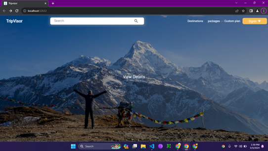
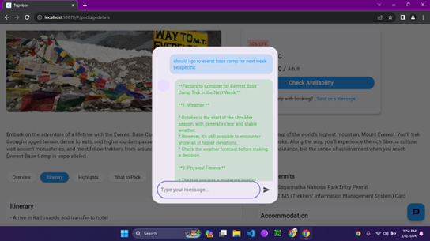
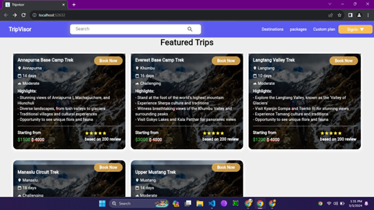
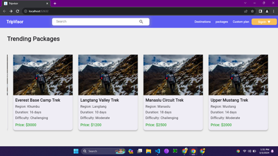
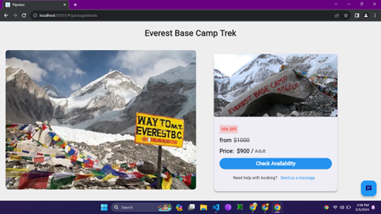
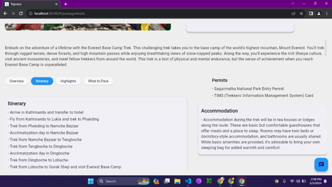

# TripVisor

TripVisor is a web-based application designed to simplify the exploration and booking of trekking packages in Nepal. With its user-friendly interface, this platform empowers individuals to effortlessly discover and select their desired trekking destinations. Users can browse through a diverse catalog of trekking packages, each carefully curated and uploaded by accredited agencies. These packages feature essential details including pricing, itineraries, and other information, facilitating informed decision-making for aspiring adventurers.

## Features

- Most popular trekking destination and exclusive deals suggestion for new users.
- User-friendly travel planning interface to seamlessly navigate and plan their trips with ease.
- Up-to-date information hub for tourists.
- Relevant packages listing for tourists according to specific destinations.
- Provide complete overall details of booked travel packages.
- AI Chat support.

## Installation

1. Clone the repository: `git clone https://github.com/niranjandahal/tripvisormajor.git`
2. Navigate to the project directory: `cd tripvisormajor`
3. get used packages: `flutter pub get`
4. run the application: `flutter run`

## Screenshots

### Landing Page

### AI ChatBot

### featured packages

### trending packages

### package Overview

### Package Details

### Login & Sign Up Interface

## Contributing

Contributions are welcome! Please follow the guidelines in the [CONTRIBUTING.md](https://github.com/your-username/tripvisor/blob/main/CONTRIBUTING.md) file.

## License

This project is licensed under the [MIT License](https://github.com/your-username/tripvisor/blob/main/LICENSE).